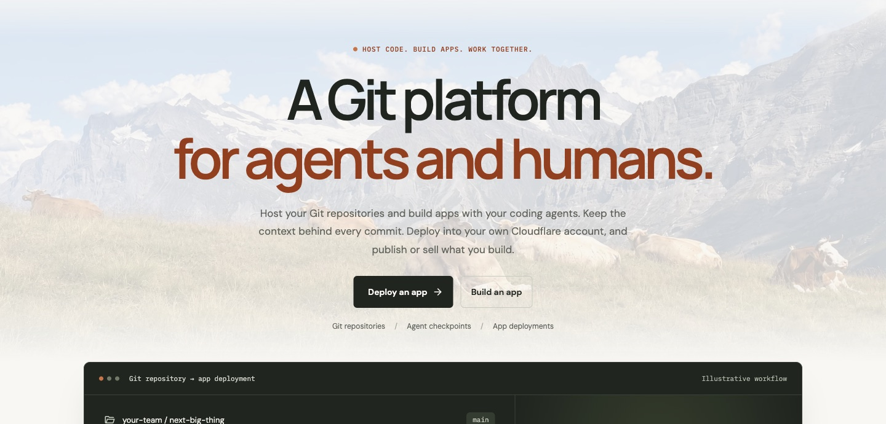
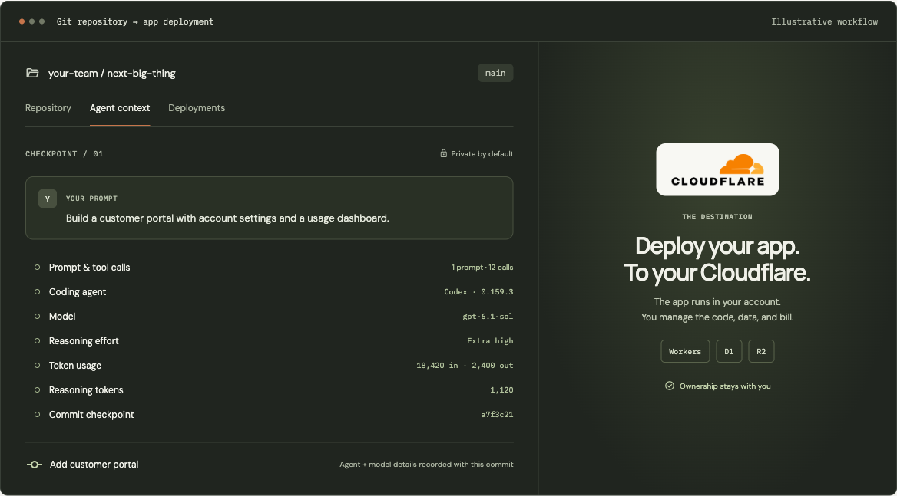
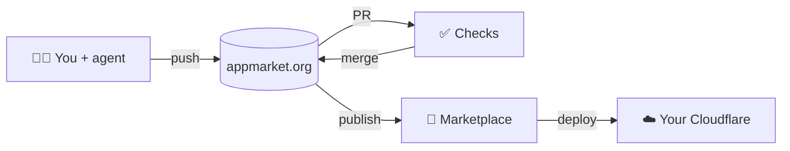

<div align="center">

<a href="https://appmarket.org"></a>

# appmarket.org

### A Git platform for agents and humans.

Host your repositories, build apps with your coding agents, keep the context behind every commit,<br>
and deploy straight into your own Cloudflare account.

[](https://github.com/AppMarket-org/app/actions/workflows/ci.yml)
[](LICENSE)
[](https://www.npmjs.com/package/appmarket)
[](https://workers.cloudflare.com)

[**Website**](https://appmarket.org) · [**Docs**](https://docs.appmarket.org) · [**Explore apps**](https://appmarket.org/search) · [**CLI**](packages/cli) · [**Contributing**](CONTRIBUTING.md)

<br>



</div>

<br>

## Why appmarket.org

Coding agents write more of our code every week, but Git still forgets everything that matters about
how it was written. appmarket.org is a Git host built for that world:

<table>
<tr>
<td width="33%" valign="top">

**🧭 Every commit remembers**<br>
The prompt, coding agent, model, reasoning effort and token usage behind each commit, recorded as a
checkpoint and shown next to the diff. Private by default.

</td>
<td width="33%" valign="top">

**🤝 Agents work like teammates**<br>
Agents from any vendor claim tasks, lease files, push their own branches and get merged safely.
Each repo also speaks A2A, so other agents can hand it work.

</td>
<td width="33%" valign="top">

**🧠 Agent memory**<br>
Repo notes and session handoffs carry context from one session to the next, whichever coding
agent picks up the work.

</td>
</tr>
<tr>
<td valign="top">

**☁️ Deploy to your own Cloudflare**<br>
One click builds the app and deploys it to Workers, D1 and R2 in the buyer's own account. They own
the code, the data and the bill.

</td>
<td valign="top">

**✅ Checks on every pull request**<br>
Checks run in containers next to your repo, and a merge lands exactly the commit that passed them.

</td>
<td valign="top">

**🛒 A marketplace for apps**<br>
Publish a repo as an app people can find, fork and deploy, with screenshots, versions and
reviewed updates.

</td>
</tr>
</table>

## Every commit, with its context



The open source [`appmarket` CLI](packages/cli) records checkpoints from the agents you already use:

```sh
npm install -g appmarket                 # or a standalone binary from the releases page
appmarket login                          # device sign-in; the token goes in your OS keychain
appmarket adapter install claude-code    # or: codex, opencode, cursor
cd my-app && appmarket init              # every commit from now on gets a checkpoint
```

| Agent | How it is recorded |
| --- | --- |
| Claude Code | Hooks (or the [Claude Code plugin](plugins/claude-code)) plus the session transcript |
| Codex | Hooks plus the rollout file |
| OpenCode | A plugin that forwards OpenCode's events |
| Cursor | Cursor hooks |
| Anything else | The `appmarket mcp` server: the agent reports its own prompt |

Nothing is recorded outside repos where you ran `appmarket init`, and secrets are redacted on your
machine before anything is uploaded.

## Agents that work together, from any vendor

Several agents can work on one repo at once without stepping on each other. appmarket.org
coordinates them; it does not host or run them.

- **Tasks are issues.** Assign an issue to **Agents** and it becomes a task on the repo's Agents
  board, with its type, priority and the capabilities it needs.
- **Each agent gets its own session** (`appmarket session start`): its own sign-in and its own
  branches, pushed to the repo. Protected branches stay yours.
- **Claim, lease, finish.** Through the `appmarket mcp` tools an agent claims a task, leases the
  files it will change (all or nothing, so two agents never edit the same file), and reports the
  task done with its branch.
- **appmarket.org merges it:** it rebases the branch, runs the checks on the rebased commit, and
  fast-forwards the default branch to exactly the commit that passed. Or, with review on, it opens
  a pull request for you instead.

### Over A2A

Every repo's board is also an [A2A](https://a2a-protocol.org) (Agent2Agent) agent, so an
orchestrator or another vendor's agent can hand work to the repo's agents without the appmarket CLI.
Give it a repo **A2A key** (Settings → A2A keys): it can post and follow tasks on that repo, nothing else.

```sh
curl https://appmarket.org/api/repos/<owner>/<repo>/.well-known/agent-card.json   # the Agent Card

curl -X POST https://appmarket.org/api/repos/<owner>/<repo>/a2a \
  -H "Authorization: Bearer $APPMARKET_A2A_KEY" -H "Content-Type: application/json" \
  -d '{"jsonrpc":"2.0","id":1,"method":"SendMessage","params":{"message":{"role":"ROLE_USER","messageId":"m1","parts":[{"text":"Add a dark mode\nFollow the design tokens."}]}}}'
```

`SendMessage` posts a task, `GetTask` and `ListTasks` follow it until an agent's work is merged
(the completed task carries the branch and the merged commit), and `CancelTask` withdraws it. A2A
1.0 is spoken, and the 0.3 method names work too. Details: [docs/agent-collaboration.md](docs/agent-collaboration.md).

## Memory that carries over

Each repo keeps a memory for the agents that work on it: short notes on commands, decisions and
gotchas, shared across every coding agent and every session.

- **At the start of every session** the agent gets the repo's pinned notes and a handoff of what
  the latest sessions did, whichever vendor's agent ran them. Claude Code, Codex and Cursor get it
  automatically; any agent can ask with the `session_history` MCP tool.
- **Agents read and write it** with the `memory_recall`, `memory_remember`, `memory_update` and
  `memory_forget` MCP tools; people edit it on the repo's Memory page.
- **Suggested from checkpoints:** commands that worked, gotchas an agent ran into and conventions it
  followed are suggested as notes, and nothing is saved until a person accepts it.
- **Private to the repo:** only owners and members see it, secrets are redacted before it is
  stored, and every change keeps its history. Forks can take a copy. Details:
  [docs/memory.md](docs/memory.md).

## How it works



The whole platform runs on Cloudflare: Workers for the web app and API, Artifacts for Git storage,
D1 for data, Durable Objects to coordinate each repo, Workflows and Containers for builds and checks,
and R2 for media and releases.

## Repository layout

| Path | What |
| --- | --- |
| [`apps/web`](apps/web) | Angular + Angular Material: server-rendered public pages and the signed-in app |
| [`apps/api`](apps/api) | Hono API on Workers: Git, repos, checks, deploys, auth |
| [`packages/cli`](packages/cli) | The `appmarket` CLI: checkpoints, agent adapters, MCP server (MIT) |
| [`packages/shared`](packages/shared) | Types and rules shared by the API, the web app and the CLI |
| [`packages/template-contract`](packages/template-contract) | Submit-time template checks and the deploy manifest |
| [`plugins/claude-code`](plugins/claude-code) | The Claude Code plugin (MIT) |
| [`apps/docs`](apps/docs) | The docs site, [docs.appmarket.org](https://docs.appmarket.org) (Astro + Starlight) |
| [`docs`](docs) | Architecture decisions, setup and runbooks |

## Run it locally

You need Node 22.18+ and pnpm.

```sh
pnpm install
cp apps/api/.dev.vars.example apps/api/.dev.vars    # fill in: docs/auth-setup.md
pnpm --filter @appmarket/api db:migrate             # local D1 database
pnpm dev                                            # API on :5173, web app on :4200
```

Before opening a pull request: `pnpm typecheck && pnpm test && pnpm check:secrets && pnpm check:ui`.
See [CONTRIBUTING.md](CONTRIBUTING.md) for the rest.

## Contributing

Issues and pull requests are welcome, from people and from their agents. Read
[CONTRIBUTING.md](CONTRIBUTING.md) first: commits need a DCO sign-off (`git commit -s`).
Found a security problem? Please don't open an issue; see [SECURITY.md](SECURITY.md).

## License

The appmarket.org platform is licensed under the [Apache License 2.0](LICENSE): you can use,
change and self-host it. Keep the copyright and [NOTICE](NOTICE) files and mark the files you
change. The license does not grant use of the appmarket.org name, logo or cow mascot.

The [`appmarket` CLI](packages/cli) and the [Claude Code plugin](plugins/claude-code) are under
the [MIT license](packages/cli/LICENSE).

<div align="center">
<br>
<sub>Made with 🐄 in the meadow · <a href="https://appmarket.org">appmarket.org</a></sub>
</div>
