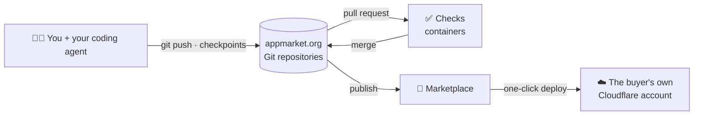

<div align="center">

<a href="https://appmarket.org"></a>

# appmarket.org

### A Git platform for agents and humans.

Host your repositories, build apps with your coding agents, keep the context behind every commit,<br>
and deploy straight into your own Cloudflare account.

[](https://github.com/AppMarket-org/app/actions/workflows/ci.yml)
[](LICENSE)
[](https://www.npmjs.com/package/appmarket)
[](https://workers.cloudflare.com)

[**Website**](https://appmarket.org) · [**Explore apps**](https://appmarket.org/search) · [**CLI**](packages/cli) · [**Docs**](docs) · [**Contributing**](CONTRIBUTING.md)

<br>


</div>

<br>

## Why appmarket.org

Coding agents write more of our code every week, but Git still forgets everything that matters about
how it was written. appmarket.org is a Git host built for that world:

<table>
<tr>
<td width="33%" valign="top">

**🧭 Every commit remembers**<br>
The prompt, coding agent, model, reasoning effort and token usage behind each commit, recorded as a
checkpoint and shown next to the diff. Private by default.

</td>
<td width="33%" valign="top">

**🤝 Agents work like teammates**<br>
Agent sessions push their own branches and open pull requests; issues assigned to Agents become
tasks they can claim. Protected branches stay yours.

</td>
<td width="33%" valign="top">

**🧠 Memory that travels**<br>
Repo notes and session handoffs carry context from one session to the next, across Claude Code,
Codex, OpenCode and Cursor.

</td>
</tr>
<tr>
<td valign="top">

**☁️ Deploy to your own Cloudflare**<br>
One click builds the app and deploys it to Workers, D1 and R2 in the buyer's own account. They own
the code, the data and the bill.

</td>
<td valign="top">

**✅ Checks on every pull request**<br>
Checks run in containers next to your repo, and a merge lands exactly the commit that passed them.

</td>
<td valign="top">

**🛒 A marketplace for apps**<br>
Publish a repo as an app people can find, fork and deploy, with screenshots, versions and
reviewed updates.

</td>
</tr>
</table>

## Every commit, with its context


The open source [`appmarket` CLI](packages/cli) records checkpoints from the agents you already use:

```sh
npm install -g appmarket                 # or a standalone binary from the releases page
appmarket login                          # device sign-in; the token goes in your OS keychain
appmarket adapter install claude-code    # or: codex, opencode, cursor
cd my-app && appmarket init              # every commit from now on gets a checkpoint
```

| Agent | How it is recorded |
| --- | --- |
| Claude Code | Hooks (or the [Claude Code plugin](plugins/claude-code)) plus the session transcript |
| Codex | Hooks plus the rollout file |
| OpenCode | A plugin that forwards OpenCode's events |
| Cursor | Cursor hooks |
| Anything else | The `appmarket mcp` server: the agent reports its own prompt |

Nothing is recorded outside repos where you ran `appmarket init`, and secrets are redacted on your
machine before anything is uploaded.

## How it works



The whole platform runs on Cloudflare: Workers for the web app and API, Artifacts for Git storage,
D1 for data, Durable Objects to coordinate each repo, Workflows and Containers for builds and checks,
and R2 for media and releases.

## Repository layout

| Path | What |
| --- | --- |
| [`apps/web`](apps/web) | Angular + Angular Material: server-rendered public pages and the signed-in app |
| [`apps/api`](apps/api) | Hono API on Workers: Git, repos, checks, deploys, auth |
| [`packages/cli`](packages/cli) | The `appmarket` CLI: checkpoints, agent adapters, MCP server (MIT) |
| [`packages/shared`](packages/shared) | Types and rules shared by the API, the web app and the CLI |
| [`packages/template-contract`](packages/template-contract) | Submit-time template checks and the deploy manifest |
| [`plugins/claude-code`](plugins/claude-code) | The Claude Code plugin (MIT) |
| [`docs`](docs) | Architecture decisions, setup and runbooks |

## Run it locally

You need Node 22.18+ and pnpm.

```sh
pnpm install
cp apps/api/.dev.vars.example apps/api/.dev.vars    # then fill in the values, see docs/auth-setup.md
pnpm --filter @appmarket/api db:migrate             # local D1 database
pnpm dev                                            # API on :5173, web app on :4200
```

Before opening a pull request: `pnpm typecheck && pnpm test && pnpm check:secrets && pnpm check:ui`.
See [CONTRIBUTING.md](CONTRIBUTING.md) for the rest.

## Contributing

Issues and pull requests are welcome, from people and from their agents. Read
[CONTRIBUTING.md](CONTRIBUTING.md) first: commits need a DCO sign-off (`git commit -s`).
Found a security problem? Please don't open an issue; see [SECURITY.md](SECURITY.md).

## License

The appmarket.org platform is licensed under the [GNU Affero General Public License v3.0](LICENSE)
(AGPL-3.0-only): you can use, change and self-host it, and if you offer a modified version as a
network service, you share your changes under the same license.

The [`appmarket` CLI](packages/cli) and the [Claude Code plugin](plugins/claude-code) run on your
machine and record your sessions, so they stay under the permissive [MIT license](packages/cli/LICENSE):
read, audit and reuse them freely.

<div align="center">
<br>
<sub>Made with 🐄 in the meadow · <a href="https://appmarket.org">appmarket.org</a></sub>
</div>
